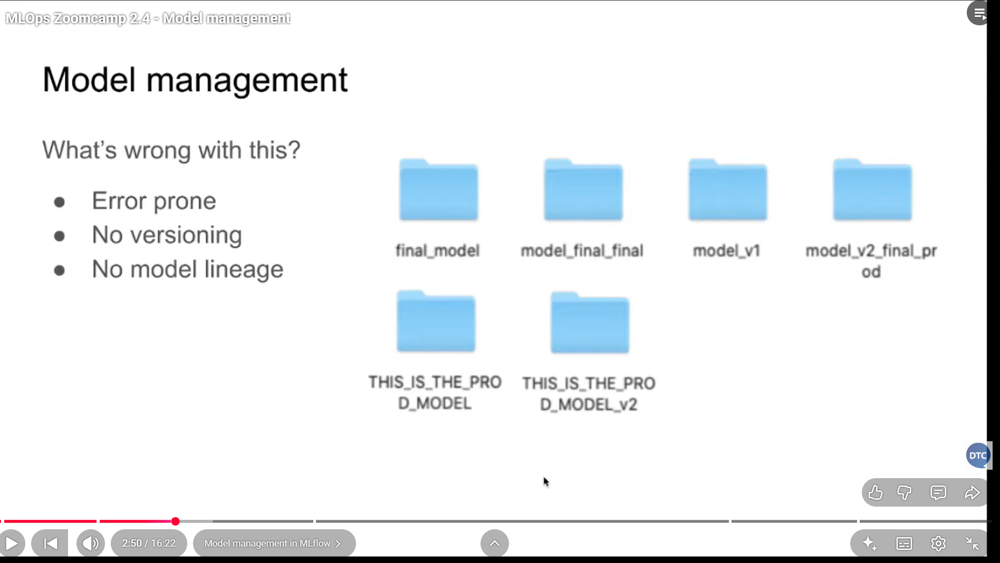
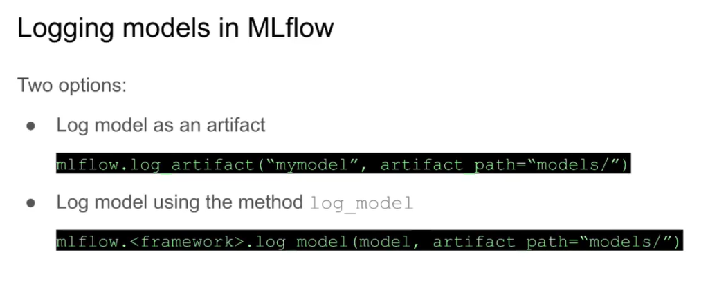
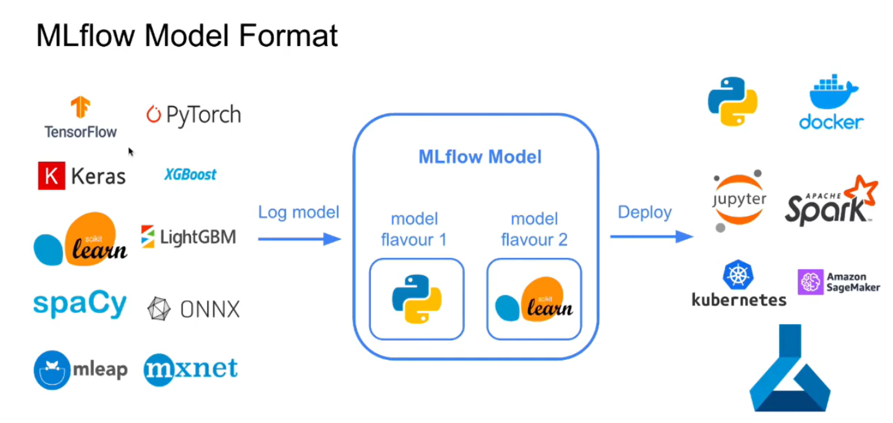

- [What is experiment tracking?](#what-is-experiment-tracking)
- [What is MLFlow](#what-is-mlflow)
  - [Tracking](#tracking)
  - [Projects](#projects)
  - [Models](#models)
  - [Model Registry](#model-registry)
- [Video Lecture Notes](#video-lecture-notes)
  - [MLOps Zoomcamp 2.2 - Getting Started with MLflow](#mlops-zoomcamp-22---getting-started-with-mlflow)
  - [MLOps Zoomcamp 2.3 - Experiment Tracking](#mlops-zoomcamp-23---experiment-tracking)
    - [Prepare the environment](#prepare-the-environment)
    - [Experiment Tracking Code](#experiment-tracking-code)
    - [TODO Access to UI via tunnel](#todo-access-to-ui-via-tunnel)
  - [MLOps Zoomcamp 2.4 - Model management](#mlops-zoomcamp-24---model-management)
  - [MLOps Zoomcamp 2.5 - Model registry](#mlops-zoomcamp-25---model-registry)
  - [MLflow in Practice](#mlflow-in-practice)
  - [MLflow: benefits, limitations and alternatives](#mlflow-benefits-limitations-and-alternatives)

# What is experiment tracking?

- Experiment tracking intro
- Getting started with MLflow
- Experiment tracking with MLflow
- Saving and loading models with MLflow
- Model registry
- MLflow in practice
- Homework

It is the process of tracking all the relevant information of machine learning experiments. Information such as

- Code
- Version
- Environment
- Data
- Model
- Artifacts
- Metrices
- Hyperparameters etc.

This helps in reproducibility, better organized way of doing the projects.

- Why is experiment tracking important ?

  - Reproducibility
  - Organisation
  - Optimisation

Next question could be how do we track then? Well, at a very basic level one might use excel to track the information manually but that is **error prone**, **difficult to collaborate** and **does not have a standard template** to cater to all the needs of **tracking mechanism**.

Is there are a better way of achieving this? Yes, there are many open source and proprietary tools that can be leveraged. MLFlow, Neptune, Weights and Biases, Comet.ml, Volohai, Tensorboard, SageMaker etc. In this tutorial we are not going to discuss about which one is better over the other, however, we are going to focus on MLFlow.

# What is MLFlow

MLFlow is language-agnostic, open source and addresses all the aspects of entire machine learning life cycle including tracking, reproducibility, deployment and storage. MLFlow was open sourced by Databricks in 2018 and since then it has gained a lot of traction in adoption.

MLFlow is quite easy to use. It is just a python package that we can install using pip. It has following four elements -

- Tracking
- Projects
- Models
- Registry

## Tracking

MLFlow tracks all the runs or executions in an experiment. When we say run, that is basically an execution of some piece of data science code. The following information is tracked:

- Parameters
- Metrics
- Metadata
- Artifacts
- Models

MLFlow Logs below extra information

- Source Code
- Version of the code( git commit )
- Start and end run times
- Author

MLFlow Tracking provides an API as well as an UI for logging required related information while running the code. It also lets you query the experiments using Python and a few other languages.

The next question is where is this tracking information is stored? For that MLFlow provides a number of options such as localhost, localhost with SQLite DB, localhost with tracking server, Remote tracking server and stores etc.

More details on MLFlow Tracking:  
https://mlflow.org/docs/latest/tracking.html

```
mlflow
mlflow ui
```

## Projects

It is a directory or a Git repo containing code files following a convention so that users or tools can run the project using its entry point(s). If a project contains multiple algorithms that can be run separately, in that multiple entry points are mentioned in MLProject file.

Properties of a project:

- Name - Name of the project
- Entry Points - Typically a .py or .sh file to run the entire project or some specific functionality, say an algorithm. List of entry points are mentioned in MLProject file
- Environment - Specifications such as library dependencies for the software environment for the code to run. Supported environments - conda environments, virtualenv environments, docker environments.

More details on MLFlow Projects:  
https://mlflow.org/docs/latest/projects.html

## Models

It is a directory where the model is saved along with a few related files denoting its properties, associated information and environment dependencies. Generally a model is served by a variety of downstream tools for serving in real time through REST API or in batch mode. And, the format or flavour of the saved model is decided based on which downstream tool is going to use for model serving. For example mlflow Sklearn library allows loading the model back as a scikit-learn pipeline object while mlflow sagemaker tool wants the model in python_function format. mlflow provides a powerful option for defining required flavours in MLmodel file.

A typical model directory contains the following files:

- MLmodel - a YAML file describing model flavours, time created, run_id if the model was created in experiment tracking, signature denoting input and output details, input example, version of databricks runtime (if used) and mlflow version
- model.pkl - saved model pickle file
- conda.yaml - environment specifications for conda environment manager
- python_env.yaml - environment specification for virtualenv environment manager
- requirements.txt - list of pip installed libraries for dependencies

More details on MLFlow models:  
https://mlflow.org/docs/latest/models.html

## Model Registry

Enterprises conduct a lot of experiments and move the selected models to production. Having said that a lot of models are created and saved in mlflow Models. Some of them are for new requirements and rest as updated models for same requirements. We needed a versioning and stage transitioning system for the models, that is fulfilled by mlflow Model Registry.

Model Registry serves as a collaborative hub where teams share models and work together from experimentation to testing and production. It provides a set of APIs as well as a UI to manage the entire life cycle of an mlflow model.

Model Registry concepts to manage life cycle of mlflow model:

- Model - An mlflow model logged with one of the flavours `mlflow.<model_flavour>.log_model()`
- Registered model - An mlflow model registered on Model Registry. It has a unique name, contains versions, transitional stages, model lineage and other associated metadata.
- Model Version - Version of the registered model
- Model Stage - Each distinct model version can be associated with one stage at a time. Stages supported are Staging, Production and Archived.
- Annotations and descriptions - Add useful information such as descriptions, data used, methodology etc. to the registered model.

More details on MLFlow Model Registry:  
https://mlflow.org/docs/latest/model-registry.html


# Video Lecture Notes

## MLOps Zoomcamp 2.2 - Getting Started with MLflow

## MLOps Zoomcamp 2.3 - Experiment Tracking

Intro: This transcript outlines a practical walkthrough for adding hyperparameter tuning to a notebook, visualizing results with MLflow UI, and selecting the best model. It also introduces MLflow auto-logging for certain frameworks to streamline experimentation.

Center:

- Hyperparameter tuning workflow
  - Start with a simple model and move to a more complex one (Lasso to XGBoost-like Boosting) to demonstrate tuning.
  - Use Hyperopt to optimize hyperparameters via Bayesian methods and a defined search space.
  - Objective function computes validation error (RMSE) and signals success with a status flag.
  - Define search space with techniques like q-uniform and log-uniform to explore discrete and continuous hyperparameters (e.g., max_depth, learning_rate, subsampling, etc.).
  - Implement an evaluation loop: train on training data, predict on validation data, compute RMSE, and return it for optimization.
  - Collect and log results into MLflow, associating each trial with parameter values and performance metrics.
- MLflow UI for results
  - After multiple runs, use the UI to compare experiments via parallel coordinates, scatter, and contour plots.
  - Filter by algorithm name or tag to focus on relevant results, then sort by RMSE to identify top performers.
  - Use highlighting to reveal parameter regions correlated with lower RMSE.
  - Observations: low mean_child_weight and certain learning-rate regions often yield improvements; max_depth patterns are less clear and may depend on other parameters.
- Best model selection and verification
  - Use MLflow’s filtering and sorting to isolate the best-performing run.
  - Inspect the best parameter set and RMSE; consider model size and training time as practical constraints.
  - Re-train the chosen model with the obtained parameters on full training data if desired.
- Auto-logging vs manual logging
  - Auto-logging is available for several frameworks (e.g., XGBoost, PyTorch, TensorFlow, Keras, Scikit-learn, etc.).
  - Enabling auto-log captures a rich set of parameters, metrics, and artifacts automatically, reducing boilerplate code.
  - Manual logging remains useful for customized experiments or less-supported frameworks.
- Practical tips
  - Tag experiments to ease retrieval in MLflow.
  - Use multiple visualization views to understand parameter interactions.
  - Balance RMSE improvements with model complexity and run time when selecting the final model.
  - Save the final model with its environment and dependencies (Conda or Python) to ensure reproducibility.
  - Leverage the MLflow model packaging to deploy or serve predictions.

Outro: The session demonstrates tuning an advanced model with Hyperopt, analyzing results through MLflow UI, and identifying a best-performing configuration. It also highlights auto-logging as a time-saver, while underscoring the value of manual logging for deeper control. The next section promises deeper coverage on logging, saving, and retrieving models with MLflow, plus practical guidance on controlling save behavior.

Key takeaways

- Hyperparameter optimization is feasible with Bayesian search (Hyperopt) and structured spaces.
- MLflow provides rich visualization, easy comparison, and robust experiment tracking.
- Auto-logging accelerates workflows but may be complemented with manual logs for customization.
- Always weigh performance against training time and model complexity for production readiness.

### Prepare the environment

Run the following command to create a fresh new new conda virtual environment.  
`conda create -n exp-tracking-env python=3.9`

Next we activate the newly created environment.  
`conda activate exp-tracking-env`

Install the required packages listed in requirements.txt file.  
`pip install -r requirements.txt`

mlflow comes with a CLI


We can launch mlflow ui as well. Run the following command to start mlflow ui (a gunicorn server) connected to the backend sqlite database.  
`mlflow ui --backend-store-uri sqlite:///mlflow.db`

```
2022/06/20 16:14:15 INFO mlflow.store.db.utils: Creating initial MLflow database tables...
2022/06/20 16:14:15 INFO mlflow.store.db.utils: Updating database tables
INFO  [alembic.runtime.migration] Context impl SQLiteImpl.
INFO  [alembic.runtime.migration] Will assume non-transactional DDL.
INFO  [alembic.runtime.migration] Running upgrade  -> 451aebb31d03, add metric step
INFO  [alembic.runtime.migration] Running upgrade 451aebb31d03 -> 90e64c465722, migrate user column to tags
INFO  [alembic.runtime.migration] Running upgrade 90e64c465722 -> 181f10493468, allow nulls for metric values
INFO  [alembic.runtime.migration] Running upgrade 181f10493468 -> df50e92ffc5e, Add Experiment Tags Table
INFO  [alembic.runtime.migration] Running upgrade df50e92ffc5e -> 7ac759974ad8, Update run tags with larger limit
INFO  [alembic.runtime.migration] Running upgrade 7ac759974ad8 -> 89d4b8295536, create latest metrics table
INFO  [89d4b8295536_create_latest_metrics_table_py] Migration complete!
INFO  [alembic.runtime.migration] Running upgrade 89d4b8295536 -> 2b4d017a5e9b, add model registry tables to db
INFO  [2b4d017a5e9b_add_model_registry_tables_to_db_py] Adding registered_models and model_versions tables to database.
INFO  [2b4d017a5e9b_add_model_registry_tables_to_db_py] Migration complete!
INFO  [alembic.runtime.migration] Running upgrade 2b4d017a5e9b -> cfd24bdc0731, Update run status constraint with killedINFO  [alembic.runtime.migration] Running upgrade cfd24bdc0731 -> 0a8213491aaa, drop_duplicate_killed_constraint
INFO  [alembic.runtime.migration] Running upgrade 0a8213491aaa -> 728d730b5ebd, add registered model tags table
INFO  [alembic.runtime.migration] Running upgrade 728d730b5ebd -> 27a6a02d2cf1, add model version tags table
INFO  [alembic.runtime.migration] Running upgrade 27a6a02d2cf1 -> 84291f40a231, add run_link to model_version
INFO  [alembic.runtime.migration] Running upgrade 84291f40a231 -> a8c4a736bde6, allow nulls for run_id
INFO  [alembic.runtime.migration] Running upgrade a8c4a736bde6 -> 39d1c3be5f05, add_is_nan_constraint_for_metrics_tables_if_necessary
INFO  [alembic.runtime.migration] Running upgrade 39d1c3be5f05 -> c48cb773bb87, reset_default_value_for_is_nan_in_metrics_table_for_mysql
INFO  [alembic.runtime.migration] Running upgrade c48cb773bb87 -> bd07f7e963c5, create index on run_uuid
INFO  [alembic.runtime.migration] Context impl SQLiteImpl.
INFO  [alembic.runtime.migration] Will assume non-transactional DDL.
INFO:waitress:Serving on http://127.0.0.1:5000
```

To access mlflow ui open https://127.0.0.1:5000 in your browser.

This is how it looks like.  


### Experiment Tracking Code

[Notebook for Experiment Tracking with MLflowipynb](/mlflow_in_work.ipynb)

[Colab Notebook](https://colab.research.google.com/drive/1S8FM0XBtJ-tXPVNJxvvLdYqmZ5Vv_G-T)

### TODO Access to UI via tunnel

Notebook

```
!npm install -g localtunnel
!mlflow ui --port 5000 --host 0.0.0.0 &
!lt --port 5000 &
Output:
https://nine-flies-do.loca.lt
```

Terminal

```
curl https://loca.lt/mytunnelpassword
wget -q -O - https://loca.lt/mytunnelpassword
```

## MLOps Zoomcamp 2.4 - Model management

Welcome everyone. In this video, we explore _model management_ within the machine learning lifecycle. The Neptune.ai diagram is used to frame ideas: experiment tracking is a subset of ML Apps (MLAps), while modern management combines experiment tracking, model versioning, deployment, and hardware scaling. We review how to move from experiments to production-ready models and monitoring.

**Center**

- The ML lifecycle steps include: experiment tracking, saving/versioning models, deploying, scaling, and monitoring predictions.
- Traditional file-based versioning (folders and spreadsheets) is error-prone: overwrites, unclear versioning, and no traceability of data, hyperparameters, or datasets.
  
- Modern management with MLflow provides two core approaches to saving models:

  1. _Log artifact_ (artifact-only saving)
  2. _Log model_ (comprehensive model packaging with multiple flavors and environment info)



- Experiment tracking with MLflow can log parameters, metrics, and artifacts. When saving a model as an artifact, you get a file (e.g., a pickle) accessible via the MLflow UI, but it lacks rich provenance.
- Saving with _log model_ creates an MLflow model (mlmodel) file with flavors such as Python function and a framework-specific flavor (e.g., Boost). It also captures environment details (Python version, library versions) and can include a conda.yaml or requirements.txt. This enables flexible loading later as a Python function or as the framework object (e.g., Boost) for inference.
- To ensure reproducible preprocessing, save the preprocessor as an artifact alongside the model. This supports consistent data transformation for future predictions.
- MLflow can generate code snippets to help deploy or load models for predictions in Spark (via spark_udf) or Pandas, using either Python function flavor or framework-specific flavors.
- Loading a model from MLflow supports multiple flavors: Python function, Boost, and others. This makes deployment across environments (Docker, cloud services like SageMaker or Azure) straightforward.
- The video demonstrates two concrete flows: logging artifacts vs. logging models. The latter yields richer metadata and easier model retrieval and deployment.



---

**Key Takeaways (bolded):**

- _Experiment tracking_ is foundational but insufficient alone for production.
- _Model versioning_ and _artifact management_ must be integrated with provenance.
- _MLflow_ offers two logging paths: artifacts (simpler) and models (rich provenance, multiple flavors).
- _Environment capture_ (conda.yaml, Python versions) is critical for reproducibility.
- _Preprocessor persistence_ is essential for end-to-end inference consistency.
- _Code generation for deployment_ (Spark/Pandas) accelerates real-world use.
- _Flexibility_ across flavors enables loading models as Python functions or framework objects.

---

**Tables (examples):**

- Logging approaches

| Approach     | Pros                                                 | Cons                                                    |
| ------------ | ---------------------------------------------------- | ------------------------------------------------------- |
| Log Artifact | Simple, quick access to the file                     | Limited provenance, harder to reuse across environments |
| Log Model    | Rich metadata, multiple flavors, environment capture | Slightly more setup, may require more familiarity       |

- Flavors supported by MLflow (examples)

| Flavor             | Use case                                   |
| ------------------ | ------------------------------------------ |
| Python function    | Load as a Python callable for predictions  |
| Boost              | Load as a Boost model for native inference |
| TensorFlow/PyTorch | Deploy using framework-native APIs         |

**Note:** All emphasized points aim to clarify how modern model management with MLflow improves traceability, reproducibility, and deployment readiness.

## MLOps Zoomcamp 2.5 - Model registry

- **Model Management with MLflow Model Registry**


> [!NOTE]
> _Model Regisrty_ Just lists the models. Need CI/CD to actually deply the models

Just like mlflow tracking server tracks all the experiments, in similar fashion model registry tracks the models that are registered for productionization. Models from the runs in an experiment as saved using either mlflow.log_artifact or mlflow.log_model. Moreover, Auto log option also saves the model by default.

MLflow Model Registry allows to assign the registered model to any of stages - Stage, Production and Archive. While registering a model to Model Registry, a new model name can be added or an existing one can be selected. If an existing one is selected, a new version of the model is created automatically.


All these activities can be performed on UI as well as with the Python APIs provided by mlflow client.

The deployment engineers then take the models from the Registry to deploy. CICD can also be implemented to make the deployment process automated.

## MLflow in Practice

Depending upon the project and number of data scientists going to collaborate, the configurational aspect of mlflow is decided. Consider the following three scenarios.

- A single data scientist participating in a competition
- A cross-functional team with single data scientist
- Multiple data scientists working together on models

**Configure MLflow**
Let us consider following architectural components of mlflow. A mlflow tracking server has two components - Backend store and Artifact store. Depending upon the requirements we may need to have both of them locally or in a local server or a remote server.

- Backend store (Used to store metadata)
  - Local file system (When one participates in competition and needs to track experiments locally)
  - SQLAlchemy compatible DB such as SQLite (Locally but in a DB and DB is must to register models)
- Artifact Store (To store model and other artifacts)
  - Local file system (locally store in a folder when one does not need to share with others)
  - Remote (Say, there is a need to store the artifacts in S3 bucket)

## MLflow: benefits, limitations and alternatives

**Benefits**

- Share and collaborate with other members
- More visibility into all the efforts

**Limitations**

- Security - restricting access to the server
- Scalability
- Isolation - restricting access to certain artifacts

**When not to use**

- Authentication and user profiling is required
- Data versioning - no in-built functionality but there are work arounds
- Model/Data monitoring and alerts are required

**Alternates**

- Nepture.ai
- Comet.ai
- Weights and Biases
- etc
